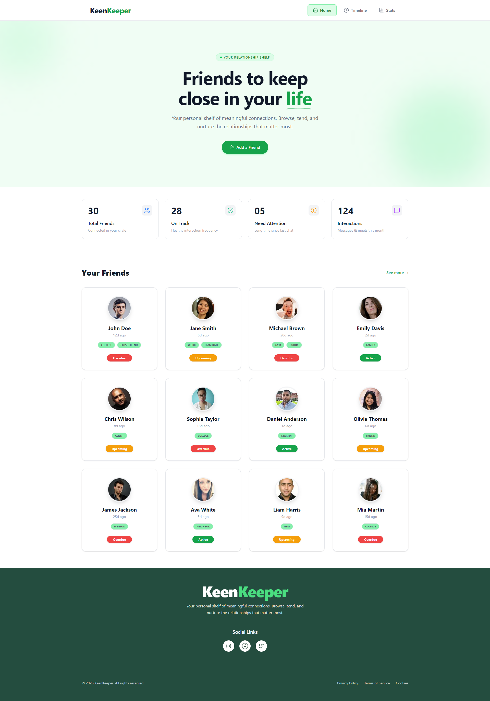
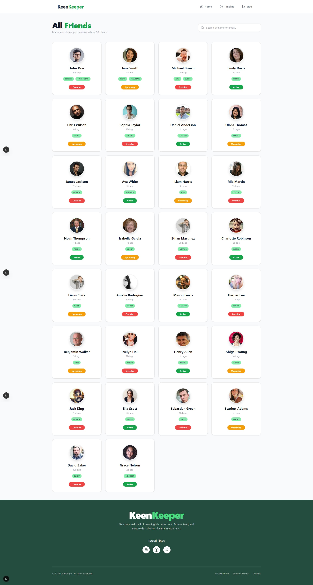
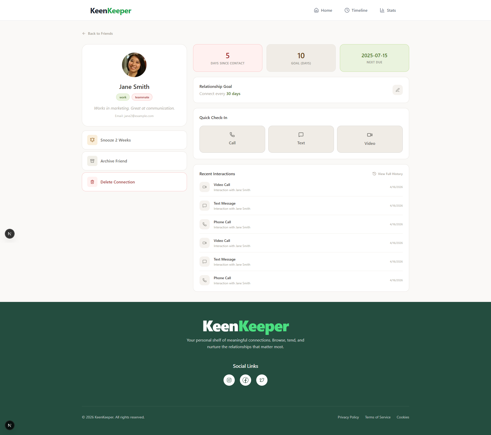

# KeenKeeper — Keep Your Friendships Alive

> A friendship management web app that helps you stay in touch with the people who matter most.

---

## 🌐 Live Demo & Repository

| 🚀 Live Site | 💻 GitHub Repo |
|---|---|
| [🔗 View Live](https://keen-keeper-lemon.vercel.app/) | [📂 View on GitHub](https://github.com/ziaulhoquepatwary/KeenKeeper.git) |

## 📸 Screenshots

### 🏠 Home Page


### 👥 All Friends Page


### 👤 Friend Details Page


## 📌 About The Project

**KeenKeeper** is a personal friendship tracker that reminds you when it's time to reach out to someone. Life gets busy — this app makes sure no important relationship slips through the cracks.

You can see all your friends at a glance, check how many days have passed since you last contacted them, log quick check-ins (Call, Text, or Video), and view a full timeline of all your interactions. A dedicated Stats page shows your communication patterns through a pie chart.

---

## 🛠️ Technologies Used

| Technology | Purpose |
|---|---|
| **Next.js** | React framework for routing and page structure |
| **Tailwind CSS** | Utility-first CSS for responsive styling |
| **Recharts** | Pie chart for the Friendship Analytics (Stats) page |
| **React Hot Toast** | Toast notifications for user feedback |
| **JSON (friends.json)** | Local data file to store friend profiles |

---

## ✨ Key Features

### 1. 👫 Smart Friend Cards with Status System
Friends are displayed as clean cards showing photo, name, tags, days since last contact, and a color-coded status badge — **Overdue**, **Upcoming**, or **Active**. The home page shows 8 friends by default with a **"See more"** button that expands to all 30 friends on a dedicated All Friends page.

### 2. 🔍 Search & Sort
The All Friends page includes a **search bar** to filter friends by name or email, and a **sort option** to organize friends the way you need.

### 3. 📋 Interactive Timeline with Filters
Every time you click **Call**, **Text**, or **Video** on a friend's detail page, a new entry is automatically logged to the Timeline with the current date. The Timeline page supports **filtering by interaction type** (Call, Text, Video) so you can find specific interactions quickly.

### 4. 📊 Friendship Analytics (Stats Page)
A dedicated Stats page with a **Pie Chart** built with Recharts showing the breakdown of Call, Text, and Video interactions — giving you a visual overview of how you're staying in touch.

### 5. 📱 Fully Responsive
The entire app works seamlessly across **mobile, tablet, and desktop** screen sizes.

---

## 📄 Pages Overview

| Page | Route | Description |
|---|---|---|
| Home | `/` | Banner, summary cards, first 8 friends |
| All Friends | `/friends` | Full friend list with search & sort |
| Friend Details | `/friends/[name]` | Friend info, stats, quick check-in |
| Timeline | `/timeline` | Full interaction history with filters |
| Stats | `/stats` | Pie chart analytics |
| 404 | `*` | Custom not-found page |

---

## 🚀 Getting Started Locally

```bash
# Clone the repository
git clone https://github.com/ziaulhoquepatwary/KeenKeeper.git

# Navigate into the project
cd keen-keeper

# Install dependencies
npm install

# Run the development server
npm run dev
```

Then open [http://localhost:3000](http://localhost:3000) in your browser.

---

## 👨‍💻 Author

**Ziaul Hoque Patwary**  
📧 Email: [**ziaul.dev@gmail.com**] 
🔗 GitHub: [ziaulhoquepatwary](https://github.com/ziaulhoquepatwary)
---